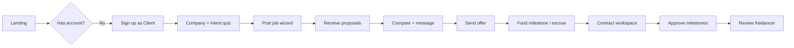

# Freelance Near Me — Product & Platform Modernization

> Strategic blueprint: user journeys (Upwork-informed), legacy bad practices, recommended stack for **Vercel + Neon Postgres**, integrations, and delivery order by **order of magnitude** (impact × risk × effort).

---

## Executive summary

The legacy app is a **CodeIgniter monolith** with custom wallet/escrow, 30+ modules, and PHP-session auth. The current MERN scaffold (`server/` + `client/`) proves core CRUD flows but is **not the best production shape for Vercel**.

**Recommended target architecture:**

| Layer | Choice | Rationale |
|-------|--------|-----------|
| Hosting | [Vercel](https://vercel.com) | Edge, previews, Cron, native Blob, Marketplace integrations |
| App | **Next.js 15+** (App Router) | Single deploy unit: UI + API routes + Server Actions |
| Database | **Neon Postgres** + **Prisma** | Relational marketplace (users, jobs, proposals, contracts, ledger) |
| Auth | **Clerk** (Vercel Marketplace) | OAuth, sessions, employer/freelancer metadata, lower security burden |
| Payments | **Stripe Connect** | Replace custom `ESCROW_WALLET` / `wallet_*` logic |
| Search | **Typesense** or Algolia | Faceted job/talent search at scale |
| Files | **Vercel Blob** | Portfolios, deliverables, avatars |
| Email | **Resend** | Transactional + digests |
| Realtime | **Ably** or Pusher | Messaging (Phase 4) |
| Cache / rate limits | **Upstash Redis** | Sessions, job alerts, API limits |

Treat the existing MERN code as a **UX/API prototype** to migrate into Next.js, not the long-term split Express deployment (awkward on Vercel serverless limits and cold starts).

---

## Order of magnitude — delivery phases

Impact is scored **relative to marketplace survival** (trust + hire loop + money). Do not build contests, affiliates, or hourly screenshot trackers until Phases 1–4 are excellent.

### Phase 0 — Stop the bleeding (1–2 weeks) · Magnitude: **Critical**

| Item | Why |
|------|-----|
| Rotate DB credentials exposed in `application/config/database.php` | Secrets in git = existential risk |
| Turn off `db_debug` in any production config | Leaks schema/SQL to users |
| Freeze legacy feature work | No new PHP modules |
| Stand up Vercel preview + Neon staging | Safe iteration |
| Legal: replace placeholder terms/privacy in new app | Required before payments |

**Outcome:** Safe foundation to ship the new product.

---

### Phase 1 — Core marketplace loop (4–6 weeks) · Magnitude: **10×**

This is what Upwork optimizes for: **post → propose → hire → pay → review**. Your MVP skipped **proposals** and **contracts** — without them you have a job board, not a marketplace.

| Feature | Upwork analogue | Notes |
|---------|-----------------|-------|
| Guided onboarding | “I want to hire” / “Find work” split | Separate paths after signup (not one generic form) |
| Rich profiles | Freelancer profile, employer company | Skills, rate, portfolio, availability |
| Job posting wizard | Post a job | Budget type, scope, skills, screening questions |
| Proposal flow | Submit proposal | Cover letter, bid, timeline, attachments |
| Client proposal inbox | Review proposals | Shortlist, message, decline |
| Offer + contract | Hire → contract | Fixed/hourly terms, start date |
| Basic messaging | Pre-hire questions | Thread per job/proposal |

**Tech:** Next.js + Prisma schema for `Job`, `Proposal`, `Contract`, `MessageThread`.

**Outcome:** A freelancer can win work and an employer can hire without leaving the platform.

---

### Phase 2 — Trust & money (4–6 weeks) · Magnitude: **8×**

| Feature | Integration |
|---------|-------------|
| Stripe Connect onboarding | Freelancer payouts, platform fee |
| Escrow / milestone funding | PaymentIntent + Connect transfers (replaces wallet tables) |
| Milestone approval & release | Server-side state machine, webhooks only |
| Invoices & receipts | Stripe + PDF or email |
| Email notifications | Resend (proposal received, offer, payment) |
| Identity / email verify | Clerk + optional Stripe Identity |

**Outcome:** Revenue-ready; custom `myfinance` wallet code retired.

---

### Phase 3 — Work delivery (3–4 weeks) · Magnitude: **5×**

| Feature | Notes |
|---------|-------|
| Contract workspace | Single URL per contract (replaces `projectroom/*`) |
| Milestones & deliverables | Blob uploads, approval workflow |
| Activity timeline | Audit trail for disputes |
| In-app notifications | DB + email; push later |

**Outcome:** Users stay in-product through delivery (Upwork “workroom”).

---

### Phase 4 — Discovery & growth (ongoing) · Magnitude: **4×**

| Feature | Integration |
|---------|-------------|
| Faceted search | Typesense sync from Postgres |
| Saved searches & job alerts | Cron + Resend |
| Reviews & Job Success Score | Weighted rating after contract close |
| SEO job/talent pages | Next.js SSG/ISR per slug |
| Analytics funnel | PostHog or Vercel Analytics |

**Outcome:** Organic acquisition and repeat usage.

---

### Phase 5 — Legacy parity (only if validated) · Magnitude: **1–2×**

Defer unless metrics demand: contests, affiliates, membership tiers, hourly screenshot tracker, LinkedIn import, multi-language CMS, `ecadmin/`, PayPal parallel to Stripe.

---

## User journey redesign (Upwork-informed)

### Design principles

1. **Intent-first landing** — Two primary CTAs: “Hire talent” vs “Find work” (not four equal buttons).
2. **Progressive profiling** — Collect minimum at signup; complete profile before first post/proposal.
3. **One contract, one workspace** — After hire, all actions live under `/contracts/[id]`.
4. **Payment never surprises** — Show platform fee and escrow rules before hire.
5. **Mobile-first** — Browse jobs and reply to messages on phone (Upwork’s highest traffic).

### Employer journey



| Step | Legacy pain | Modern target |
|------|-------------|---------------|
| Post job | CKEditor, captcha, approval gate | Step wizard, autosave draft, instant publish for verified clients |
| Review talent | Scattered dashboards | Unified inbox with filters (rate, rating, availability) |
| Hire | `select_provider`, multiple dashboard versions | Single “Send offer” with contract preview |
| Pay | Custom wallet + manual escrow | Stripe-funded milestones |
| Deliver | `projectdashboard_new` vs `projecthourly` split | One contract type system with `billingMode: fixed \| hourly` |

### Freelancer journey

```mermaid
flowchart LR
  A[Landing] --> B[Sign up as Talent]
  B --> C[Profile: skills + rate + portfolio]
  C --> D[Browse / search jobs]
  D --> E[Submit proposal]
  E --> F[Client messages]
  F --> G[Offer received]
  G --> H[Accept + Connect onboarding]
  H --> I[Contract workspace]
  I --> J[Submit work / log time]
  J --> K[Get paid]
  K --> L[Review client]
```



| Step | Legacy pain | Modern target |
|------|-------------|---------------|
| Find work | Heavy filters, weak relevance | Saved search + email alerts |
| Apply | Unclear if “bid” exists in MVP | Structured proposal (price, duration, answers) |
| Get hired | Multiple project room URLs | Notification + deep link to contract |
| Paid | Wallet ledger complexity | Stripe balance + payout schedule visible |

### Guest / SEO journey

- Public job pages: `/jobs/[slug]` (indexable, Open Graph).
- Public talent pages: `/freelancers/[username]`.
- Category hubs: `/jobs/category/web-development` (content + listings).

---

## Legacy bad practices (write-off list)

### Security & compliance

| Issue | Evidence | Fix |
|-------|----------|-----|
| Production DB credentials in repo | `application/config/database.php` | Rotate immediately; use Vercel/Neon env vars only |
| MD5 password hashing (some flows) | e.g. `npost_model.php` uses `md5($password)` | Clerk or bcrypt/argon2 everywhere; force password reset |
| SQL injection risk | `findjob_model.php` builds `LIKE '%{$term}%'` with `addslashes` | Parameterized queries (Prisma) |
| `db_debug => TRUE` | `database.php` | Never expose SQL errors in production |
| Session-only auth | `$this->session->userdata('user')` everywhere | HttpOnly cookies via Clerk; CSRF on mutations |
| No API boundary | Controllers return HTML + ad-hoc JSON | Typed API routes + Zod validation |

### Architecture & maintainability

| Issue | Impact |
|-------|--------|
| 30+ HMVC modules with duplicated controllers | Impossible to test; inconsistent behavior |
| Dated backup files (`*_10.07.18`, `* - Copy.php`) | Unknown which code runs |
| 3k+ line controllers (`dashboard.php`) | Single change breaks unrelated flows |
| Parallel implementations (`projectdashboard` vs `projectdashboard_new` vs `projecthourly`) | User confusion, double maintenance |
| Custom double-entry wallet (`ESCROW_WALLET`, `wallet_add_fund`) | Financial bugs = company-ending |
| PayPal + Stripe + wire + internal balance | Reconcile nightmare; use Stripe Connect only |
| jQuery/Bootstrap/CKEditor front end | Slow, inaccessible, poor mobile UX |
| i18n via dozens of PHP lang files | Use next-intl + CMS for content only |

### Product / UX

| Issue | Upwork does instead |
|-------|---------------------|
| Homepage = carousel + many modules | Clear value prop + personalized feed |
| “Post job” behind verify gate without explanation | Explain steps; show progress |
| No unified proposal inbox | Central “Proposals” for both sides |
| Project room URL patterns vary | One contract URL |
| Contests + jobs + hourly tracker | Pick core model first |

### Current MERN scaffold gaps (fix in Next migration)

| Gap | Priority |
|-----|----------|
| No proposal/bid model | P0 |
| No contract or milestone entities | P0 |
| MongoDB less ideal for financial ledger | Migrate to Postgres |
| JWT in cookie without refresh/rotation strategy | Use Clerk |
| `dangerouslySetInnerHTML` for descriptions | Sanitize (DOMPurify) or markdown |
| Express on Vercel | Collapse to Next.js Route Handlers |

---

## Recommended integrations (Vercel Marketplace–first)

| Category | Primary | Alternative | When |
|----------|---------|-------------|------|
| Auth | **Clerk** | Auth0 | Phase 1 |
| Database | **Neon** + Prisma | Supabase | Phase 0–1 |
| Payments | **Stripe Connect** | — | Phase 2 |
| Email | **Resend** | SendGrid | Phase 2 |
| File storage | **Vercel Blob** | Uploadthing | Phase 3 |
| Search | **Typesense Cloud** | Algolia | Phase 4 |
| Realtime chat | **Ably** | Pusher | Phase 3–4 |
| Redis | **Upstash** | — | Rate limits, alerts |
| Analytics | **PostHog** | Vercel Analytics | Phase 1+ |
| Errors | **Sentry** | — | Phase 0 |
| CMS (blog/marketing) | **Sanity** | Contentful | Phase 4 |
| ID verification | **Stripe Identity** | Persona | Optional Phase 2 |
| Cron | **Vercel Cron** | — | Digests, sync jobs |
| AI (optional) | Vercel AI Gateway | — | Proposal tips, job description assist |

### Stripe Connect model (replaces custom escrow)

- **Employer** pays platform → funds held on connected account or separate charge + transfer pattern.
- **Platform fee** taken at payout or charge time (configurable %).
- **Milestones** map to PaymentIntents; release via Transfer when client approves.
- Webhooks are source of truth — never update balance only in app code.

---

## Data model sketch (Postgres / Prisma)

Core entities for Phase 1–2:

```
User (synced with Clerk)
  ├── ClientProfile
  └── FreelancerProfile (skills, rate, portfolioItems)

Job (draft → open → filled → closed)
  └── JobSkill

Proposal (submitted → shortlisted → accepted → declined)
  └── ProposalAttachment

Contract (from accepted proposal)
  ├── Milestone (pending → funded → submitted → approved → paid)
  ├── MessageThread
  └── Review (both parties)

Payment (Stripe ids, amount, status) — append-only ledger
```

Do **not** port `serv_*` MySQL tables 1:1. Map legacy `projects` → `Job`, `bids` → `Proposal`, `project_milestone` → `Milestone`.

---

## Vercel deployment shape

```
freelancenearme.com/
  apps/web/          # Next.js (only production app)
  packages/db/       # Prisma schema + migrations
  packages/ui/       # shadcn components (optional)
  legacy/            # move PHP here read-only (optional)
```

- **Production:** `main` → Vercel production, Neon prod branch.
- **Preview:** every PR → preview URL + Neon branch (or seed DB).
- **Env:** `vercel env pull` + Clerk/Stripe/Neon via Marketplace (`vercel integration add neon`).

Express `server/` can run temporarily on **Railway/Fly** if needed during migration, but end state should be **one Next.js project on Vercel**.

---

## Inspiration from Upwork (what to copy vs skip)

| Copy | Skip (for now) |
|------|----------------|
| Clear hire vs work signup | Upwork Enterprise / payroll |
| Job post with budget + skills | Complex catalog of “Connects” currency |
| Proposal comparison table | Aggressive upsell on every click |
| Contract workspace | Native desktop time tracker |
| Milestone escrow | Agency hierarchy (unless B2B focus) |
| Public reviews + success score | — |
| Saved searches & alerts | — |

**Differentiator for “Near Me”:** emphasize **local + remote** (geo filters, timezone, “near me” map optional), faster onboarding for SMBs, transparent fees vs Upwork’s layered costs.

---

## Migration path from today

1. **Keep** `client/` UI patterns (home, jobs, talents) as design reference.
2. **Scaffold** `apps/web` Next.js + Prisma + Clerk on Vercel.
3. **Import** seed data from Mongo seed or one-time MySQL export script → Postgres.
4. **Redirect** production domain to Vercel when Phase 1 + 2 pass smoke tests.
5. **Archive** PHP to `legacy/` (read-only) after 30-day parallel run.

---

## Success metrics (per phase)

| Phase | Metric |
|-------|--------|
| 1 | Time to first proposal < 10 min; hire conversion tracked |
| 2 | First successful Stripe payout; zero wallet drift |
| 3 | % messages sent inside platform vs email |
| 4 | Organic traffic to job pages; alert CTR |

---

## Next implementation decision

**Start Phase 1 in Next.js** (not extend Express MERN): proposals + contracts + Clerk + Neon. The highest-magnitude missing piece is the **proposal → hire** loop — everything else is secondary.

When ready, say which to build first: **Next.js scaffold on Vercel**, **MySQL→Neon migration script**, or **proposal flow UI**.
